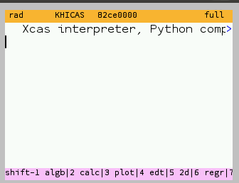

# Guide d'utilisation de KhiCAS

## Clarification de la terminologie

- Retour ou Back signifie la touche retour à côté du bouton OK. Nous utiliserons la dénomination "touche effacer" ou similaire pour parler de la touche pour effacer des caractères, située à côté de la boite à outils.

- Le mot firmware est utilisé pour signifier "Système d'exploitation pour la calculatrice"

## Installation

La méthode d'installation de KhiCAS dépend du firmware installé sur votre calculatrice. Si vous ne savez pas, lisez le paragraphe ci-dessous

### Reconnaître le firmware installé

Pour reconnaître le firmware installé sur votre calculatrice, regardez le texte écrit dans la barre de titre de votre calculatrice

- Si le texte est "applications", vous utilisez sûrement Epsilon, le firmware officiel de la calculatrice NumWorks.

- Si le texte est "Omega", vous utilisez sûrement le firmware tier Omega, vous permettant d'utiliser KhiCAS de manière plus complète que sur Epsilon

- Si le texte est "Upsilon", vous utilisez sûrement le firmware tier Upsilon, basé sur Omega, vous permettant d'utiliser des version plus récentes que celles disponibles sur Omega, encore plus puissantes !

### Installation de KhiCAS sur Epsilon

Ce guide n'est pas prévu pour Epsilon, mais vous pouvez
l'installer depuis [ce site](https://www.nwagyu.com/apps/khicas/)

### Installation de KhiCAS sur Omega

Pour installer KhiCAS sur Omega, rendez vous sur [ce site](https://external.getomega.dev/), sélectionnez Omega puis cliquez sur installer. Votre slot B sera effacé

### Installation de KhiCAS sur Upsilon

Sur Upsilon, vous devez passer par le bootloader pour installer KhiCAS. Cela effacera votre slot B.

1. Appuyez sur RESET
2. Vous devriez voir Upsilon Calculator s'afficher
3. Appuyez sur 4 (Installer Mode)
4. Appuyez sur 1 (Flash Slots)
5. La calculatrice affiche `Waiting for Slots...`
6. Rendez vous sur [ce site](https://upsilonnumworks.github.io/Upsilon-External/).
7. Ajoutez Omega puis cliquez sur installer.
8. Cliquez sur installer et sélectionnez votre calculatrice (Upsilon Calculator)
9. Appuyez sur RESET
10. Démarrez votre calculatrice normalement

## Premier lancement

KhiCAS se trouve en dernière position du menu Home, après les paramètres. Pour le lancer, appuyez sur OK, comme pour n'importe quelle application.

Lors du premier lancement de KhiCAS, on arrive sur des choix de langue et d'interpréteur.

Taper OK et OK pour être en français et en langage xCAS (calcul formel).

## Shell

Une fois la configuration terminée, on arrive sur la fenêtre du shell. Dans cette fenêtre, on peut taper des commandes, des expressions mathématiques, des calculs simples… Si vous êtes en interpréteur xCAS, vous aurez un bandeau rose en bas. Si vous avez choisi MicroPython, il sera jaune

On observe qu'il y a des menus en bas. Pour y accéder, il suffit de taper shift + le nombre correspondant (shift + 1, shift + 2, shift + 3…)

Pour commencer, nous allons taper une expression mathématique : $\left(3 x+1\right)^{5}$

À ce moment-là, nous pouvons

- Appuyer sur shift + 5 ou flèche gauche pour ouvrir l'affichage 2D
- Taper OK pour copier le résultat dans la zone d'entrée d'expression
- Appuyer sur flèche droite pour ouvrir le mode édition. Ses menus sont gris et permet d'éditer un calcul déjà lancé et de recalculer tout les calculs situés en dessous.

Nous allons utiliser shift + 5 et explorer la vue 2D.

## Vue 2D

La vue 2D se reconnaît à sa barre de menu verte.

Pour revenir dans le shell, il suffit de cliquer sur OK ou retour, mais nous allons d'abord explorer cette vue.

On remarque qu'une partie de l'expression seulement est sélectionnée (fond gris). Il faut savoir que les fonctions qui vont être utilisées ne vont s'appliquer qu'à la sélection

Pour naviguer dans la vue 2D, il y a quelque commandes simples :

- Flèche haut pour monter d'un cran de hiérarchie dans l'expression

- Flèche bas pour descendre d'un cran de hiérarchie dans l'expression

- Flèche gauche pour se déplacer vers la gauche de l'expression dans une même zone

- Flèche droite pour se déplacer vers la droite de l'expression dans une même zone

Nous appuyons donc sur flèche haut pour sélectionner l'ensemble de l'expression.

### Dériver une expression depuis la vue 2D

Un appui sur Shift + 2 nous ouvre le menu de calcul

On sélectionne 1 pour dériver l'expression, mais la touche 2 est aussi possible et permet un plus grand paramétrage, notamment le choix de la variable de dérivation.

KhiCAS insère automatiquement la commande. On observe que l'exposant 5 s'est transformé en `**5`. C'est parce que KhiCAS a modifié l'expression.

Pour avoir le résultat, on tape sur la touche EXE, qui applique l'expression, sans quitter la vue 2D. Nous aurions aussi pu utiliser la touche OK, mais nous aurions quitté la vue 2D.

La dérivée de $\left(3 x+1\right)^{5}$ est donc $\left(15 \left(3 x+1\right)\right)^{4}$

### Développer une expression depuis la vue 2D

Pour obtenir la forme factorisée de cette dérivée, nous pouvons utiliser la commande `simplify`, depuis le menu 1. Nous ouvrons donc le menu 1.

Nous appuyons donc sur la touche 1, pour simplifier.

### Cas du texte trop grand pour rentrer sur l'écran

Malheureusement, l'expression est trop grande pour rentrer sur l'écran. Nous avons deux solutions dans ce cas-là :

- Utiliser les flèches gauche et droite pour se déplacer

- Appuyer sur Shift + 5 pour changer la police de la grande police à la petite.

Les deux solutions sont combinables. Nous choisissons de mettre la petite police.

### Factoriser une expression depuis la vue 2D

Nous souhaitons maintenant refactoriser cette expression.

Nous appuyons sur flèche haut pour tout sélectionner. Rappel : la sélection est affichée en gris.

Nous pouvons désormais demander à KhiCAS de nous factoriser l'expression. Nous allons maintenant dans le menu 1 à l'aide du raccourci shift + 1, puis le bouton 2 pour sélectionner `factor(`

Nous obtenons donc ceci :

Par contre, le texte reste écrit en petit. Pour revenir à la vue classique, nous devons appuyer sur Shift + 5. Nous avons alors la grande police, beaucoup plus lisible.

### Revenir au shell

Pour revenir au shell, il suffit d'appuyer sur la touche OK, pour sauvegarder l'expression.

Nous observons que le dernier résultat (la fonction dérivée) a été copié dans le shell.

Voilà une petite introduction aux grandes capacités de KhiCAS.

> C'est un petit pas pour l'homme, mais un grand pas pour l'humanité.

## La boite à outils

La boite à outils contient toutes les commandes de KhiCAS, il ne faut pas hésiter à se perdre dans ses menus. Vous y découvrirez des fonctions diverses et variées. Pour y accéder, il faut appuyer sur la touche toolbox, entre la touche d'effacement et la touche var.

Dans la boite à outils, les fonctions sont triées par catégories : Algèbre, algèbre linéaire, analyse…

Par exemple, nous pouvons sélectionner le menu 4 (Analyse).

Dans le menu analyse, nous trouvons notamment les fonctions :

- `desolve` pour résoudre des équations différentielles (vous pouvez utiliser `solve` dans la plupart des cas)

- `diff` pour calculer une dérivée

- `inf` pour  le symbole infini positif (`oo` peut aussi être utilisé)

- `integrate` pour calculer une intégrale (fonctionne aussi avec des bornes infinies, ou sans borne pour une primitive)

- `limit` pour calculer une limite (fonctionne aussi avec des bornes infinies)

- `tabvar` pour les tableaux de variations

- d'autres fonctions utiles !

Voilà tout, pour le moment, dans cette breve introduction des incroyables fonctionnalités de KhiCAS.

### Contrôles de la boite à outils

- La touche OK insère l'expression sélectionnée

- Les touches toolbox et flèche droite ouvrent l'aide intégrée sur la fonction sélectionnée

- Les touches EXE et Ans insèrent des exemples différents disponibles dans l'aide intégrée.

Nous décidons d'utiliser la fonction `tabvar` depuis le menu "Analyse" de la boite à outils puis nous appuyions sur OK.

La fonction est copiée dans le shell.

À ce moment là, nous pouvons faire plusieurs actions

- Appuyer sur la touche Back, effaçant ainsi les propositions de complétions
- Appuyer sur la touche Ans pour sélectionner le premier exemple d'utilisation
- Appuyer sur la flèche bas pour ouvrir l'aide intégrée.

L'aide intégré détaille rapidement l'utilité de la fonction, sa syntaxe, les raccourcis éventuels, les fonctions en lien et les exemples d'utilisation.

Nous ne voulons pas d'aide sur la fonction, nous appuyons donc sur Back pour masquer cela.

Ensuite, nous entrons la fonction dont on veux étudier les variations : $\left(3 x+1\right)^{5}$

Nous fermons la parenthèse pour éviter des éventuelles erreur de compréhension, malgré le fait que KhiCAS ferme automatiquement les parenthèses manquantes en fin de ligne.

Les parenthèses deviennent vertes car la parenthèse est fermée.

Il ne nous reste qu'a valider avec la touche OK ou EXE. Le tableau de variation s'affiche dans la vue 2D.

C'est un peu difficile à lire, mais cela nous permet de vérifier nos calculs.

On voit que la dérivée s'annule en $-\frac{1}{3}$, et qu'elle est positive sur R. Il y a un point d'inflexion en $-\frac{1}{3}$.
On voit donc que f(x) est croissante (inc = increasing) sur R. Au point d'inflexion ($x=-\frac{1}{3}$), $f\left(x\right)$ s'annule.
Les limites de f sont $-\infty$ pour $x=\mathrm{i}$, et $+\infty$ pour $x=+\infty$.

La dernière ligne est la dérivée seconde.

- Elle est négative jusqu'à $-\frac{1}{3}$, donc f est concave sur cet intervalle (symbole ^). Cela veut dire qu'elle tourne dans le sens rétrograde (aiguilles d'une montre)

- Elle est positive au-delà de $-\frac{1}{3}$ donc f est convexe sur cet intervalle (symbole U). Elle tourne donc dans le sens direct.

Bon, il ne faut pas s'attendre à quelque chose de très lisible sur les fonctions compliquées, mais ça valide les calculs qu'on fait "à la main", ce qui est dans la philosophie de KhiCAS

## Éditeur de texte

Dans la fenêtre du shell, il est également possible d'aller dans la fenêtre de script. Pour taper cela, il faut taper sur la touche Back.

Nous basculons donc sur la fenêtre d'édition, avec des menus gris. Un début de programme est présent.

- Pour exécuter le script, il faut utiliser la touche OK. En cas d'erreur, KhiCAS va automatiquement déplacer le curseur sur la ligne de l'erreur

- Pour accéder aux paramètres du script, on peut utiliser la touche Home.

- Pour revenir au shell, on utiliser la touche Back.

## Menu principal

Pour y accéder, il suffit d'appuyer sur la touche Home en étant dans le shell.

Il permet de faire plusieurs choses :

- D'accéder aux applications internes de KhiCAS (il est également possible d'utiliser le raccourci Shift + Ans pour y accéder directement)

- De gérer les sessions de KhiCAS

- De gérer les scripts

- D'effacer des scripts ou des variables

- D'entrer dans le mode examen (sous certaines conditions)

- D'afficher une liste des principaux raccourcis de KhiCAS

- D'aller dans le menu à propos avec les crédits de KhiCAS (attention : la version indiquée n'est pas forcément à jour)

- De gérer les firmwares (sur Khi avec le bootloader Khi uniquement)

- De quitter KhiCAS

## Quitter KhiCAS

Une fois que vous avez découvert KhiCAS, il peut être difficile de comprendre comment en sortir. Pour cela, c'est tout simple : il suffit de cliquer deux fois sur Home depuis le shell (appuyer plus de fois sur Home permet de quitter depuis la plupart des autres écrans)

## Crédits

Ce guide à été rendu possible grâce à la participation de :

- fm00mf pour le texte original et les captures d'écran
- Yaya-Cout pour la réécriture Markdown et PDF
- Bernard Parisse pour avoir écrit KhiCAS et sa [documentation](https://www-fourier.univ-grenoble-alpes.fr/~parisse/numworks/khicasnw.html), malgré sa taille immense diminuant la facilité de compréhension du texte
